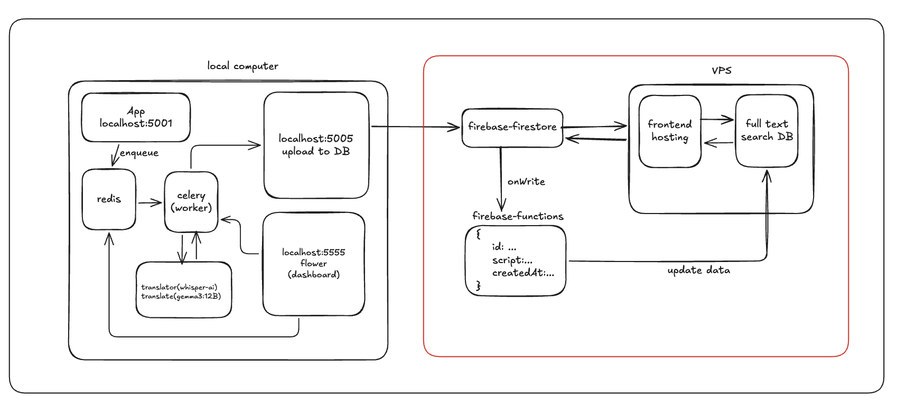

# Scriptum

[Scriptum](https://scriptum.rootly.kr)은 한글 스크립트가 없는 YouTube 동영상의 스크립트를 AI로 생성하고, 직접 업로드하여 지식 아카이브를 구축하는 웹 애플리케이션입니다. 사용자는 키워드 검색을 통해 자막 내의 특정 정보를 빠르게 찾고, 해당 시점의 영상을 즉시 재생하여 학습 효율을 높일 수 있습니다.

## 아키텍처



- 백엔드, ai pipeline은 로컬에서 실행됨

## 주요 기능 (Key Features)

- **지식 검색 및 아카이브**: 자막 기반의 정교한 검색 기능을 통해 원하는 정보를 정확하게 찾아냅니다.
- **실시간 영상 동기화**: 검색된 자막 시점으로 영상을 즉시 이동시켜 재생합니다.
- **사용자 스크립트 관리**: 관심 있는 스크립트를 저장하고 관리할 수 있습니다.
- **다국어 지원**: 다양한 언어의 자막 데이터를 처리하고 표시합니다.
- **반응형 UI**: 데스크탑 및 모바일 환경에 최적화된 사용자 인터페이스를 제공합니다.

## 기술 스택 (Tech Stack)

### Frontend

- **Core**: React 19, TypeScript, Vite
- **Styling**: TailwindCSS v4
- **State Management**: React Context / Custom Hooks
- **Routing**: React Router 7
- **Video Player**: React Player

### Backend / BaaS

- **Firebase**:
  - **Authentication**: 사용자 인증 및 관리
  - **Firestore**: 데이터베이스 (스크립트, 사용자 정보 저장)

### Search Engine

- **Typesense**: 빠르고 강력한 오타 보정 검색 기능 제공 (서버/클라우드)
- **Fuse.js**: 클라이언트 사이드 경량 검색 지원
- **React InstantSearch**: 검색 UI 구현

### Testing

- **Unit/Integration**: Vitest, React Testing Library
- **E2E**: Playwright

## 시작하기 (Getting Started)

이 프로젝트를 로컬 환경에서 실행하기 위한 방법입니다.

### 전제 조건 (Prerequisites)

- **Node.js**: v20 이상 권장
- **npm** 또는 **yarn**

### 환경 변수 설정 (Environment Setup)

프로젝트 루트에 `.env` 파일을 생성하고 다음 Firebase 설정 값을 입력해야 합니다.

```env
VITE_FIREBASE_API_KEY=your_api_key
VITE_FIREBASE_AUTH_DOMAIN=your_auth_domain
VITE_FIREBASE_PROJECT_ID=your_project_id
VITE_FIREBASE_STORAGE_BUCKET=your_storage_bucket
VITE_FIREBASE_MESSAGING_SENDER_ID=your_messaging_sender_id
VITE_FIREBASE_APP_ID=your_app_id
VITE_FIREBASE_MEASUREMENT_ID=your_measurement_id
```

### 실행 (Run)

개발 서버를 실행합니다.

```bash
npm run dev
```

브라우저에서 `http://localhost:5173`으로 접속하여 확인합니다.

## 스크립트 (Scripts)

- `npm run dev`: 개발 서버 실행
- `npm run build`: 프로덕션 빌드 (TypeScript 컴파일 및 테스트 포함)
- `npm run test`: 유닛 테스트 실행 (Vitest)
- `npm run lint`: ESLint를 사용한 코드 린트
- `npm run preview`: 빌드된 애플리케이션 미리보기

## 폴더 구조 (Project Structure)

```
src/
├── assets/         # 이미지, 폰트 등 정적 자원
├── components/     # 재사용 가능한 UI 컴포넌트
├── context/        # 전역 상태 관리 (Context API)
├── hooks/          # 커스텀 React Hooks
├── pages/          # 페이지 단위 컴포넌트 (라우트)
├── services/       # Firebase 및 외부 API 통신 로직
├── types/          # TypeScript 타입 정의
├── utils/          # 헬퍼 함수 및 유틸리티
└── main.tsx        # 진입점 (Entry Point)
```

© 2026 Scriptum. All rights reserved.
